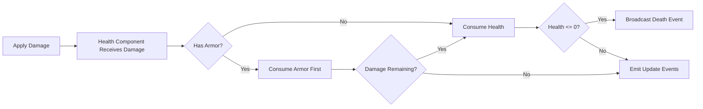
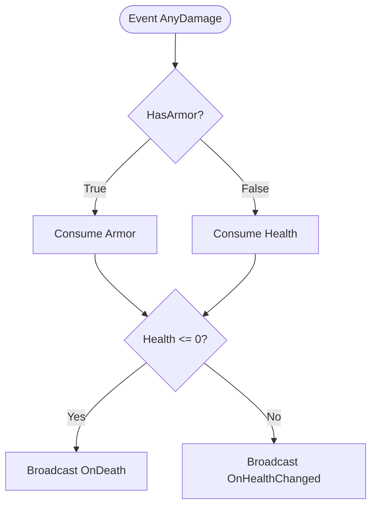
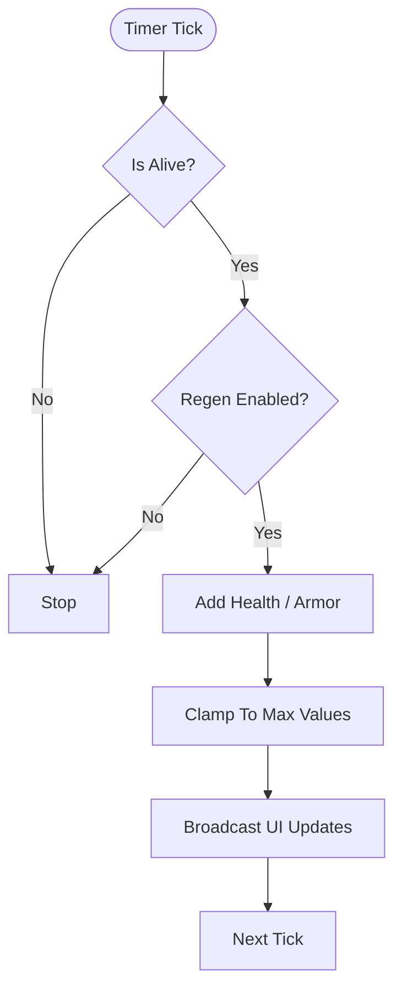

import Tabs from '@theme/Tabs';
import TabItem from '@theme/TabItem';

# Damage, Regeneration & Events

## Damage pipeline



## Toggle: Blueprint vs C++ implementation

<Tabs>
  <TabItem value="bp" label="Blueprint Visual" default>



  </TabItem>
  <TabItem value="cpp" label="C++">

```cpp
void AMyCharacter::HandleIncomingDamage(float Damage)
{
    if (!HealthComp) return;

    // Route damage into plugin component API.
    // Component handles armor->health order and event dispatching.
}
```

  </TabItem>
</Tabs>

## Event reference

| Event / Dispatcher | When to use |
|---|---|
| `OnHealthChanged` | Update HP text/progress bar |
| `OnMaxHealthChanged` | Re-scale widgets if max changes |
| `OnUpdateHealthBar` | Normalized value for progress bar |
| `OnUpdateMaxHealthBar` | Secondary bars / segmented UI |
| `OnDeath` (or equivalent) | Respawn, ragdoll, spectator switch |

## Regeneration pattern



Next: [UI + Multiplayer Patterns](/aaa-healthsystem/ui-and-multiplayer).
