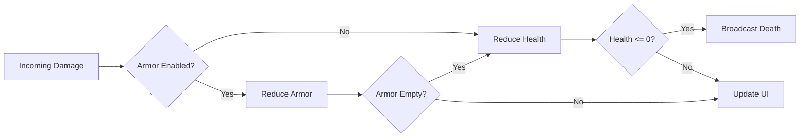
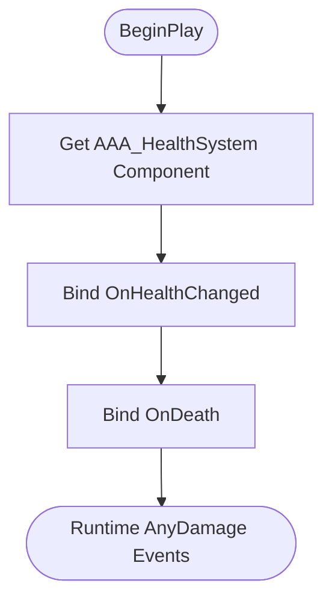

import Tabs from '@theme/Tabs';
import TabItem from '@theme/TabItem';

# AAA_HealthSystem

A production-ready health + armor framework for Unreal projects that need **clean gameplay flow**, **UI events**, and **multiplayer-safe behavior**.

## Why teams use it

- **Drop-in component model**: add one component to any actor.
- **Server-authoritative flow**: safe behavior in multiplayer.
- **UI-friendly events**: progress bars and widgets can bind directly.
- **Blueprint-first** with C++ extension support.

## What’s inside

| Capability | Included |
|---|---|
| Health + Max Health management | ✅ |
| Optional armor layer | ✅ |
| Regeneration (health/armor) | ✅ |
| Event dispatchers for HUD updates | ✅ |
| Multiplayer replication | ✅ |
| Blueprint API | ✅ |
| C++ extension points | ✅ |

## At-a-glance gameplay shape



## Blueprint vs C++ usage

<Tabs>
  <TabItem value="bp" label="Blueprint Visual" default>



  </TabItem>
  <TabItem value="cpp" label="C++">

```cpp
// Character header
UPROPERTY(VisibleAnywhere, BlueprintReadOnly)
UAAA_HealthSystemComponent* HealthComp;

// Character constructor
HealthComp = CreateDefaultSubobject<UAAA_HealthSystemComponent>(TEXT("HealthComp"));

// Example hook
void AMyCharacter::BeginPlay()
{
    Super::BeginPlay();
    // Bind delegates exposed by the component (plugin API)
}
```

  </TabItem>
</Tabs>

## Recommended reading order

1. [Installation & Setup](/aaa-healthsystem/installation-and-setup)
2. [Damage, Regeneration & Events](/aaa-healthsystem/damage-regeneration-events)
3. [UI + Multiplayer Patterns](/aaa-healthsystem/ui-and-multiplayer)


## Visual preview (provided images)


